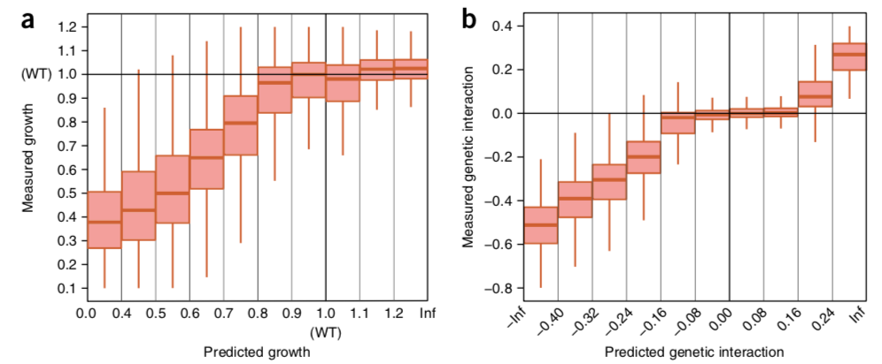
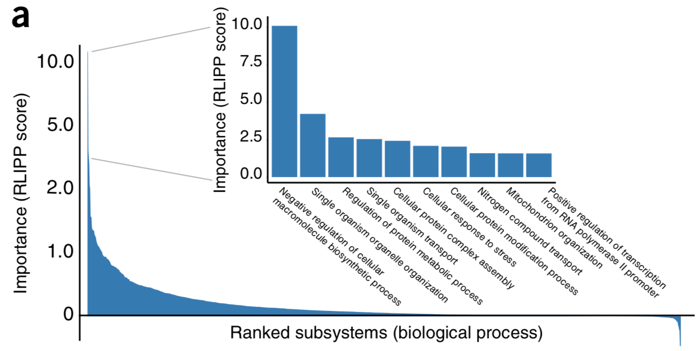
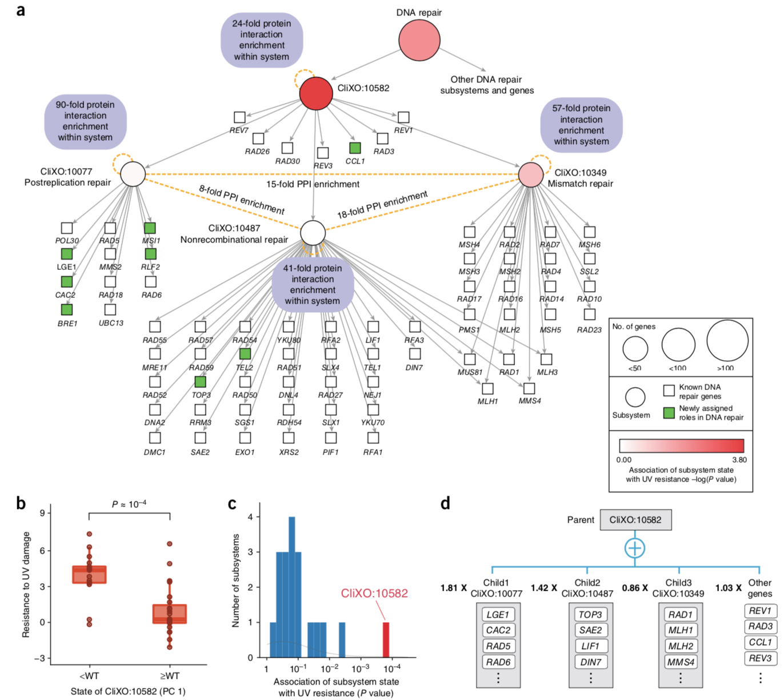

[comment]: <> (pandoc -t revealjs -s -o index.html presentation.md -V theme=$moon -V revealjs-url=./)

---
author: Stephen Checkley
title: Journal Club
date: May, 2018
---
> **Using deep learning to model the hierarchical structure and function of a cell.**

Ma J. _et al_ (2018) Nature methods. **290**:15

# Introduction

* Neural networks are powerful classifiers but their internal structures are hard to interpret.

* densely entangled network structures that are neither tied to an actual physical system nor based on human reasoning.

* Powerful but not useful where simulation is needed of system function _and_ system structure.

    * Applications in biology and medicine seek to model both functional outcome _and_ mechanism.

* "Visible neural networks" (VNN) enable relation of a neural network structure to biological function.

# DCell

* 2,526 literature curated biological systems.
    * _Saccharomyces cerevisiae_

* CliXo 4,805 biological systems using clustering from gene-gene interaction datasets.
    * 38% overlap with GO

* 8 million training genotype-phenotype examples.

# Model training

* input-output translation of the model.
* perturbation of genes propagate through the hierarchy of protein complexes, biological processes, organelles and ultimately the growth phenotype.
* Neural network is embedded into the biological hierarchy (20-1,075 neurons).
    * functional state is represented a bank of neurons.
    * connectivity of which mirrors the biological hierarchy.

# Neural network structure

* The VNN encoding the GO network = 97,181 neurons.
* CliXo network = 22,167 neurons.
* Depth for both = 12 layers.

# Performance in genotype-phenotype translation

* Extensive compendium of yeast growth phenotypes measured.
    * single & double gene-deletion genotypes
    * several million genotype-phenotype training examples
* 2 Phenotypes considered:
    1. capacity for growth measured by colony size vs wild type.
    2. for double gene deletions, genetic interaction scores measured using difference in colony size from that of single gene deletions.
* Predicting gene interactions is hard vs. absolute growth:
    * many non-linear effects.
    * weights of inputs to neurons was optimised using stochastic gradient descent computed by back propogation.

# Example model output

_[http://d-cell.ucsd.edu/](http://d-cell.ucsd.edu/)_

# Results

_Prediction of cell viability and genetic interaction phenotypes._

\(a\) Measured vs. predicted cell viability relative to wild type (wt=1.0).

\(b\) Measured vs. predicted genetic interaction scores for each double-gene-disruption genotype.

# Benchmarking

* Comparison of VNN to other modelling approaches, random assignment of genes to subsystems ('matched'), and a fully connected neural network model.
* Performance of the fully connected network is about the same, but loses all the biology.
* Matched "black box" network performs poorly without increase in number of neurons.
* The biological hierarchy provides important information not found in randomized networks.

# From prediction to mechanism

* Unlike regular neural networks, the DCell simulations can be used to query an extensive hierarchy of states of the biological subsystems.

* This enables _in silico_ studies of biological mechanism.

* 4 studies used to validate the model.

# Simulate effect of genotype change on all subsystems

* subsytems with substantial changes would be candidate mechanisms in translation of genotype to phenotype.

# _PMT1_ and _IRE1_ deletion

* 243 subsystems incorporating _PMT1_ and _IRE1_ in GO hierarchy.
* Genes associated with endoplasmic reticulum protein unfolding response (ER-UPR) & cell wall organisation and integrity.
* Validated using GFP:_Hac1_ construct - a transcriptional activator of ER-UPR.
    * Correlation of predicted ER-UPR down-regulation with _Hac1_ activity across all relevent gene disruptions \(b\).
* Correlation of all states of every subsystem in DCell shows only ER-UPR systems \(d\).

# DNA damage and repair systems

* Repeated the validation using the DNA repair subsystem which has been studied over many double gene deletions.
* _rev7_ and _rad57_ deletions in the model correlate with DNA repair subsystems \(a\).
* Correlation of all states of every system shows highest correlate with DNA repair systems \(d\).

# Systems to Phenotype

* Do complex phenotypes e.g, growth depend on many subsystems or are they dominated by a few?
* Pareto (Power Law) distribution.
* 80% of the author's cummulative importance measure = 21% of subsystems.
* Most significant system in GO was "negative regulation of cellcular macromolecule biosynthesis".
    * organisation of cellular circuits that inhibit biosynthesis - strong increase in growth when inhibited.

# Discovery of new subsystems

* Using DCell with the CliXO dataset (non-curated large-scale molecular data sets).
    * protein-protein binding, gene coexpression, gene coevolution, genetic linkage, etc.
    * Detecting nested communities within these large scale gene-interaction networks.
* Some correspond with curated biological systems, some don't.
    * 236 undocumented subsystems.
* CliXO:10651 found to be important in growth prediction.
    * Found from the elevated density of protein-protein interactions observed among 154 genes.
* CliXO:10651 is interconnected with 2 subsystems:
    1. actin filaments.
    2. ion homeostasis.

# CliXO:10651

# Discovery of new subsystems

* CliXO:10582 - a novel subsystem comprising 71 genes.
* A previously unknown grouping, containing 8 new genes.
* Interconnects 3 known subsystems: postreplication, mismatch, & nonrecombinational repair.

# Conclusion
* DCell captures nearly all phenotypic variation in cell growth from a vast collection of data. 
    * Simultaneously simulate cellular hierarchy structure _and_ function.
    * Identification of new subsystems.

* The approach combines statistical genetics and systems biology.

* A generalizable method that can be used create interpretable neural networks encoding function _and_ form.