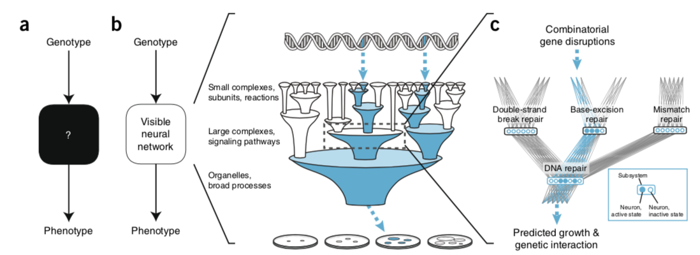

[comment]: <> (pandoc -t revealjs -s -o index.html presentation.md -V theme=$moon -V revealjs-url=./)

---
author: Stephen Checkley
title: Journal Club
date: May, 2018
---
**Using deep learning to model the hierarchical structure and function of a cell.**

Ma J. _et al_ (2018) Nature methods. **290**:15

# Introduction

* Neural networks are powerful classifiers but their internal structures are hard to interpret.

* densely entangled network structures that are neither tied to an actual physical system nor based on human reasoning.

* Powerful but not useful where simulation is needed of system function _and_ system structure.

    * Applications in biology and medicine seek to model both functional outcome _and_ mechanism.

* "Visible neural networks" (VNN) enable relation of a neural network structure to biological function.

# DCell

* 2,526 literature curated biological systems.
    * _Saccharomyces cerevisiae_

* CliXo 4,805 biological systems using clustering from gene-gene interaction datasets.
    * 38% overlap with GO

* 8 million training genotype-phenotype examples.

# Model training

* input-output translation of the model.

